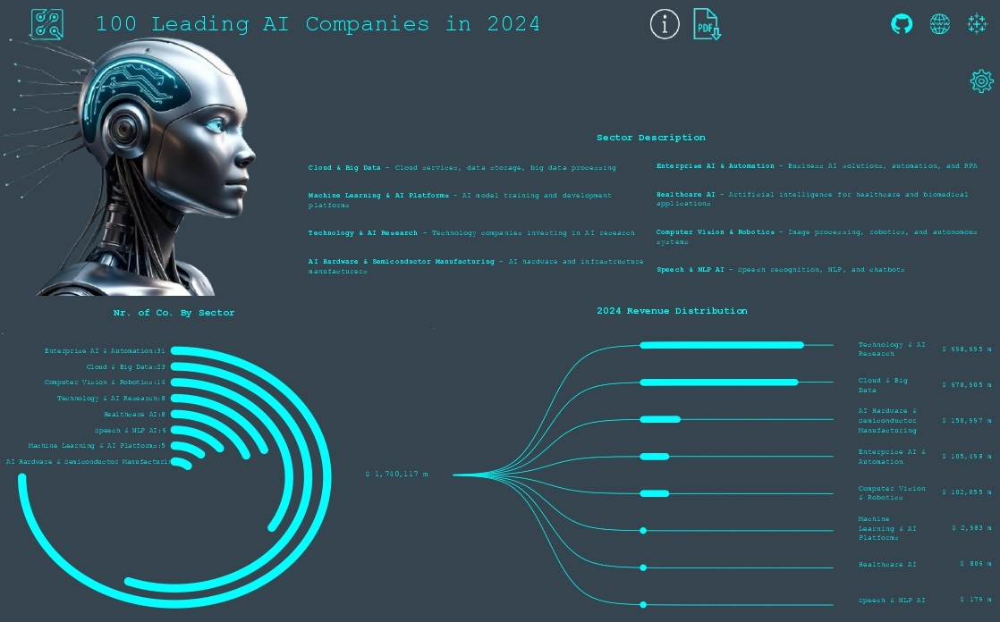

# 🤖 100 Leading AI Companies in 2024 

## Info-Data

 Another project that waw initiated from my involvement in the market and investments, combined with my strong interest in the AI industry. AI companies are not only the driving force behind the rise of stock market indexes, but they also represent the hottest sector for the next decade. As AI continues to expand, it will play a crucial role in every industry and aspect of our daily lives.

With this in mind, I wanted to explore the major players shaping the AI revolution and visualize their impact through this Tableau dashboard.

The dataset is from [kaggle](https://www.kaggle.com/datasets/raniritu/ai-companies)

## Process

I transformed the data from the CSV file to prepare it for the visualizations I wanted to create.

a) I split the headquarters location into two columns to separate the city from the country and filled 'United States' in the country column for every U.S. city.

b) I transformed the annual revenue, which was inconsistently formatted (some values in millions and others in billions, with a mix of strings and decimal numbers), using the following steps:
-  =SUBSTITUTE(SUBSTITUTE(E2; "$"; ""); " million"; "")*(removes the dollar sign and "million")*
- =SUBSTITUTE(TEXT(I2;"0.0"); "."; ",")*((required due to my local Excel version not recognizing the decimal format when converting billions to millions with following formula)*
- =IF(ISNUMBER(SEARCH("billion"; J2)); SUBSTITUTE(J2; " billion"; "") * 1000; J2)*(converts billions to millions)*

Now, the annual revenue is consistently formatted in millions for all companies with only decimals.

c) Transform Glassdoor Score  using the following formula:
 =LEFT(H2; SEARCH("/"; H2)-1)

 d)  I created a column Sectors to assign each company to one of the 8 specific sectors.

## Key Takeaways

- The total annual revenue for the 100 AI Companies for 2024 was $1,74 trillion.
- The top sectors were Technology % AI Research and Cloud & Big Data generating $698,7 and $678,9 billion, respectively.
- The 100 AI companies are distributed across 8 countries, with the United States leading by far, accounting for 80 companies.
- Among the 8 AI sectors, Enterprise AI & Automation and Cloud & Big Data have the highest representation, with 31 and 23 companies, respectively.

## 📊 Dashboards

🔗 [Tableau Link](https://public.tableau.com/app/profile/theodoros.malezidis7413/viz/100LeadingAICompaniesin2024/100LeadingAICompaniesin2024)

Dashboard

